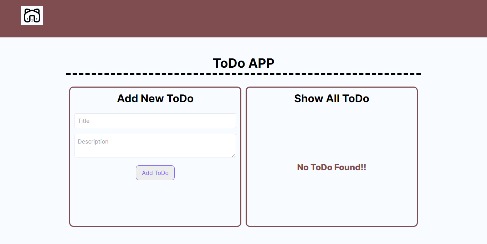
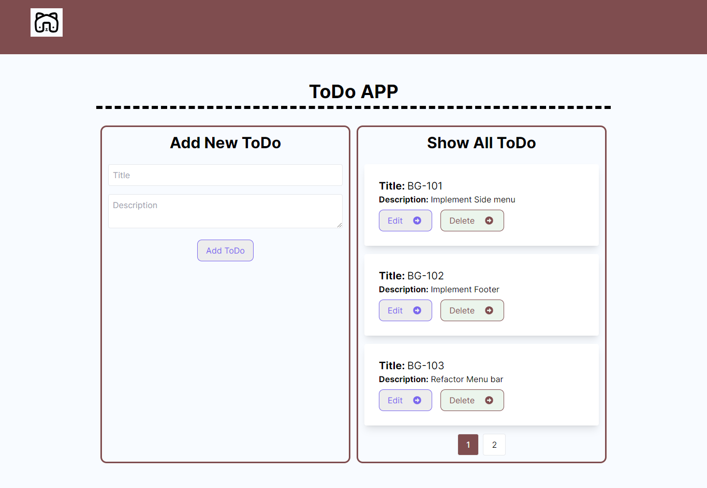

## Key Technologies

**Client-Side:** Next js, TailwindCSS

**Language:** TypeScript

**Test**: Jest

## Key Technologies

**User Can Create ToDO with Title Description**
**User Can Update ToDo By Id**
**User Can Read all ToDo List with Pagination**
**User can Remove Single ToDo element from list**

## Demo

- **Without Any ToDo Item**
  

- **With ToDo Item**
  

## Run Locally

Clone the project

```bash
  git clone https://github.com/SYShopnil/Care-Tutors-Technologies-Ltd-Task.git
```

Go to the project directory

```bash
  cd
  Care-Tutors-Technologies-Ltd-Task

```

Install dependencies

```bash
  npm install || npm i
```

Start the server

```bash
  npm run dev
```

Start the Test

```bash
  npm run test
```

## Support

For support, sadmanishopnil@gmail.com
